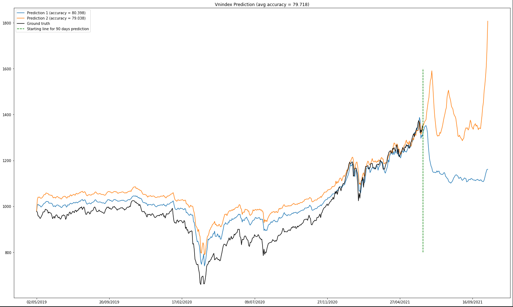
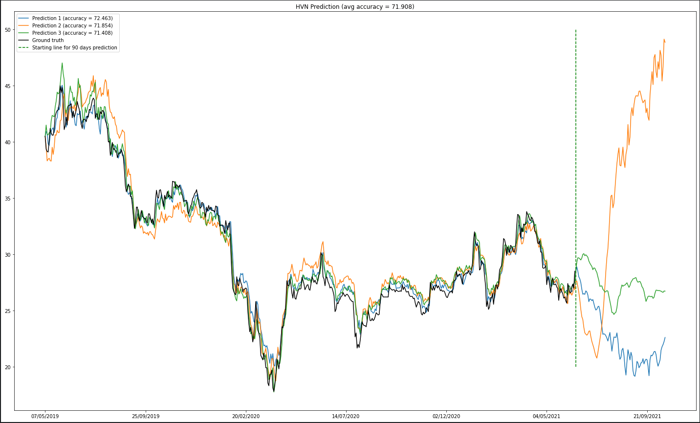
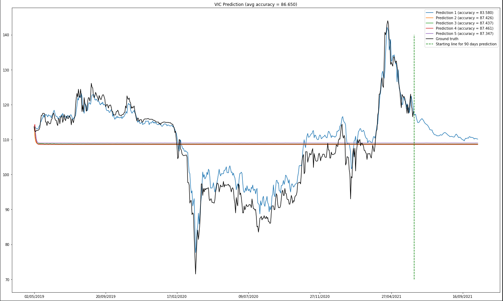
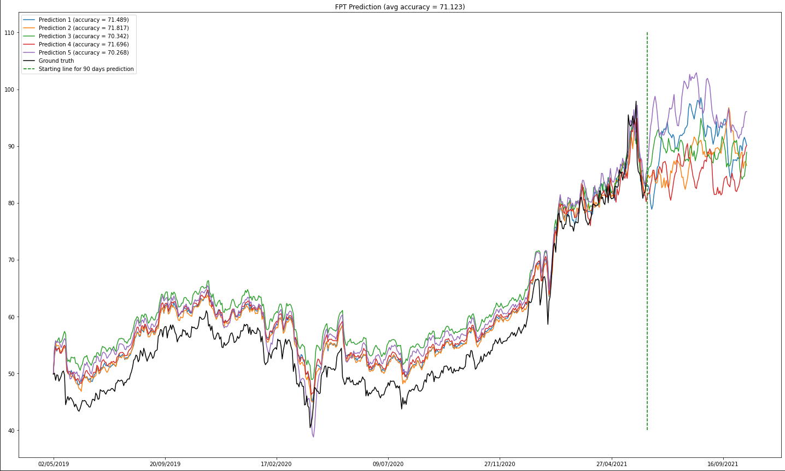
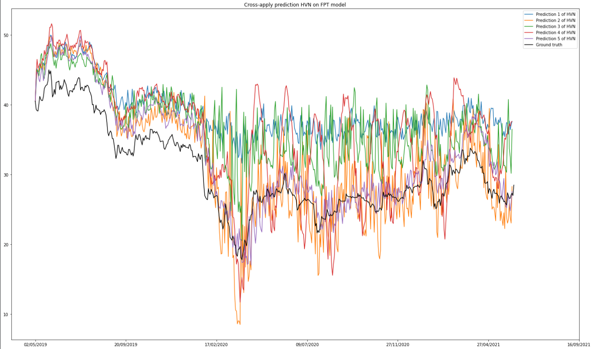
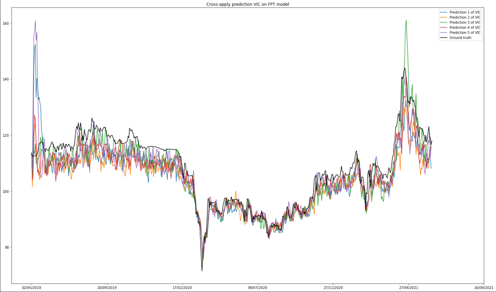

# Simple Stock Analysis

### Objective: Predicting Vietnamese stocks prices using simple LSTM.

> This is my old project from July 2021. Just an assignment from my class back then. Although it's not really well implementated and arranged, hope you will find it helpful.

## 1. Crawling Stocks Data
- Data sources:
    - [**Vietstock**](https://finance.vietstock.vn)
    - [**TVSI**](https://finance.tvsi.com.vn)
- Crawler dir: [`stock_crawler`](./stock_crawler/)
- Spiders dir: [`stock_crawler/stock_data/spiders`](./stock_crawler/stock_data/spiders/)
- Usages:

|   | Source | `cd stock_crawler` > run cmd |
|---|---|---|
| Crawling Stock Data | vietstock, tvsi | `scrapy crawl stock` |
| Crawling Sector Data | vietstock | `scrapy crawl sector` |
| Processing Influence data from raw_data_01012021_01052021 | vietstock | `scrapy crawl influence` |
| Processing Top3 and Bot3 data from raw_top3_bot3_01052019_01052021 | vietstock | `scrapy crawl top3_bot3` |
| Crawling Sum % Change | tvsi | `scrapy crawl sum_perchange` |
| Crawling Top3 & Bot3 % Change | tvsi | `scrapy crawl async_top3_bot3_sum_perchange` |
| Crawling Select3 | tvsi | `scrapy crawl select3` |

## 2. Crawled Data Structure
📦[crawled_data](./crawled_data)\
 ┣ 📂[tvsi](./crawled_data/tvsi)\
 ┃ ┗ 📂[stock](./crawled_data/tvsi/stock)\
 ┃ ┃ ┣ 📜[hnxindex.csv](./crawled_data/tvsi/stock/hnxindex.csv)\
 ┃ ┃ ┣ 📜[upcom.csv](./crawled_data/tvsi/stock/upcom.csv)\
 ┃ ┃ ┗ 📜[vnindex.csv](./crawled_data/tvsi/stock/vnindex.csv)\
 ┃ ┣ 📂[sum_perchange](./crawled_data/tvsi/sum_perchange)\
 ┃ ┃ ┣ 📜[tvsi_bot3_01012021_01052021.csv](./crawled_data/tvsi/sum_perchange/tvsi_bot3_01012021_01052021.csv)\
 ┃ ┃ ┣ 📜[tvsi_sum_perchange_01012021_01052021.csv](./crawled_data/tvsi/sum_perchange/tvsi_sum_perchange_01012021_01052021.csv)\
 ┃ ┃ ┗ 📜[tvsi_top3_01012021_01052021.csv](./crawled_data/tvsi/sum_perchange/tvsi_top3_01012021_01052021.csv)\
 ┃ ┗ 📜[tvsi_hsx_stock_code.csv](./crawled_data/tvsi/tvsi_hsx_stock_code.csv)\
 ┗ 📂[vietstock](./crawled_data/vietstock)\
 ┃ ┣ 📂[influence](./crawled_data/vietstock/influence)\
 ┃ ┃ ┣ 📂[bot3](./crawled_data/vietstock/influence/bot3)\
 ┃ ┃ ┃ ┣ 📜[ABS.csv](./crawled_data/vietstock/influence/bot3/ABS.csv)\
 ┃ ┃ ┃ ┣ 📜[PXT.csv](./crawled_data/vietstock/influence/bot3/PXT.csv)\
 ┃ ┃ ┃ ┗ 📜[TGG.csv](./crawled_data/vietstock/influence/bot3/TGG.csv)\
 ┃ ┃ ┣ 📂[top3](./crawled_data/vietstock/influence/top3)\
 ┃ ┃ ┃ ┣ 📜[DCL.csv](./crawled_data/vietstock/influence/top3/DCL.csv)\
 ┃ ┃ ┃ ┣ 📜[FUCTVGF1.csv](./crawled_data/vietstock/influence/top3/FUCTVGF1.csv)\
 ┃ ┃ ┃ ┗ 📜[RIC.csv](./crawled_data/vietstock/influence/top3/RIC.csv)\
 ┃ ┃ ┣ 📜[bot3.csv](./crawled_data/vietstock/influence/bot3.csv)\
 ┃ ┃ ┣ 📜[influence.csv](./crawled_data/vietstock/influence/influence.csv)\
 ┃ ┃ ┗ 📜[top3.csv](./crawled_data/vietstock/influence/top3.csv)\
 ┃ ┣ 📂[sector](./crawled_data/vietstock/sector)\
 ┃ ┃ ┣ 📜[bds.csv](./crawled_data/vietstock/sector/bds.csv)\
 ┃ ┃ ┣ 📜[cntt.csv](./crawled_data/vietstock/sector/cntt.csv)\
 ┃ ┃ ┗ 📜[dvltaugt.csv](./crawled_data/vietstock/sector/dvltaugt.csv)\
 ┃ ┗ 📂[stock](./crawled_data/vietstock/stock)\
 ┃ ┃ ┣ 📜[hnxindex.csv](./crawled_data/vietstock/stock/hnxindex.csv)\
 ┃ ┃ ┣ 📜[upcom.csv](./crawled_data/vietstock/stock/upcom.csv)\
 ┃ ┃ ┗ 📜[vnindex.csv](./crawled_data/vietstock/stock/vnindex.csv)
 
 ## 3. Modeling Data Structure
 📦[modeling_data](./modeling_data)\
 ┣ 📂[bot3](./modeling_data/bot3)\
 ┃ ┣ 📜[tvsi_KPF_01052019_13062021.csv](./modeling_data/bot3/tvsi_KPF_01052019_13062021.csv)\
 ┃ ┣ 📜[tvsi_TN1_01052019_13062021.csv](./modeling_data/bot3/tvsi_TN1_01052019_13062021.csv)\
 ┃ ┗ 📜[tvsi_YEG_01052019_13062021.csv](./modeling_data/bot3/tvsi_YEG_01052019_13062021.csv)\
 ┣ 📂[select3](./modeling_data/select3)\
 ┃ ┣ 📜[tvsi_FPT_01052019_13062021.csv](./modeling_data/select3/tvsi_FPT_01052019_13062021.csv)\
 ┃ ┣ 📜[tvsi_HVN_01052019_13062021.csv](./modeling_data/select3/tvsi_HVN_01052019_13062021.csv)\
 ┃ ┗ 📜[tvsi_VIC_01052019_13062021.csv](./modeling_data/select3/tvsi_VIC_01052019_13062021.csv)\
 ┣ 📂[top3](./modeling_data/top3)\
 ┃ ┣ 📜[tvsi_CIG_01052019_13062021.csv](./modeling_data/top3/tvsi_CIG_01052019_13062021.csv)\
 ┃ ┣ 📜[tvsi_FUCVREIT_01052019_13062021.csv](./modeling_data/top3/tvsi_FUCVREIT_01052019_13062021.csv)\
 ┃ ┗ 📜[tvsi_RIC_01052019_13062021.csv](./modeling_data/top3/tvsi_RIC_01052019_13062021.csv)\
 ┗ 📂[vnindex](./modeling_data/vnindex)\
 ┃ ┗ 📜[tvsi_vnindex_01052019_13062021.csv](./modeling_data/vnindex/tvsi_vnindex_01052019_13062021.csv)\
 ┃ ┗ 📜[vietstock_vnindex_08062020_13062021.csv](./modeling_data/vnindex/vietstock_vnindex_08062020_13062021.csv)

## 4. Stocks Prices Prediction using LSTM
- Predict stocks prices for **VNINDEX**, **FPT**, **HVN**, **VIC** in **90 days** after **13rd June 2021** (***the green line***).
- Cross-apply models on **FPT** for models correlation experimentation.

| [**VNINDEX**](./Modeling%20for%20VNINDEX.ipynb) | [**HVN**](./Modeling%20for%20HVN.ipynb) | [**VIC**](./Modeling%20for%20VIC.ipynb) |
|---|---|---|
|  |  |  |

| [**FPT**](./Modeling%20for%20FPT.ipynb) | [**Experiment: Cross-apply HVN model on FPT**](./Cross_apply_on_FPT.ipynb) | [**Experiment: Cross-apply VIC model on FPT**](./Cross_apply_on_FPT.ipynb) |
|---|---|---|
|  |  |  |

